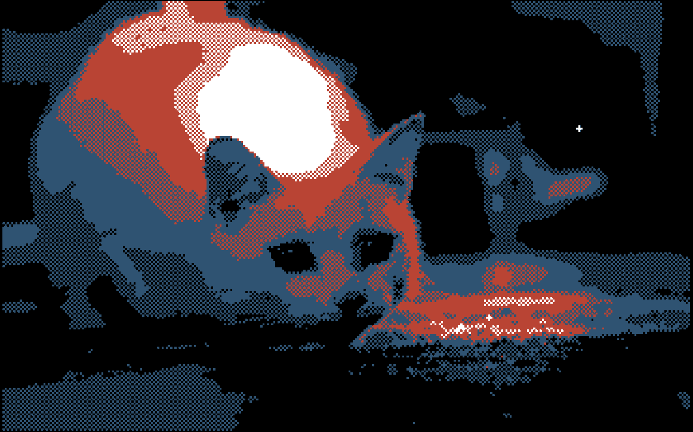

# n-bit engine

This repository is a Go software graphics rendering library implementation 
that is focused on the indexed color and pixel graphics. It uses memory buffers
to calculate and store pixel data that can be displayed on the screen by the
library of your choice (e. g. [ebiten](https://github.com/hajimehoshi/ebiten)).
Ebiten is the only notable Go library (I know) that works without CGO (no GL/GLFW bindings).

It's a software implementation, meaning it **is** slower than a videocard shader.
However, you can use it to create a game that produces a good framerate on
modern systems.

## This is about lighting

You can say that you can already use any images (limited colors or not) with the 
existing libraries and you'll be right.

This library is about lighting. It takes a greyscale image as a source and produces
indexed color paletterized image based on the light model you provide.

This image is using several point lights as a light system, but you can program any 
lighting model you can imagine.

## Features

- Lighting as described above;
- 2D sprites & (TODO) animation;
- 3D triangles with an optional perspective correction (needs more work for user-friendly API);
- 3D math package that uses matrices (similar to OpenGL) for 3D transformations;
- It targets 2-bit color primarily (4 colors), but any number of colors can be used with the library;
- Rendering code is run in parellel; you can control the number of workers that defaults to the number of CPU cores available in the system.

There's no depth buffer implementation (a full-fledged 3D engine is not the aim), but it can be added -- contributions are welcome;

## Examples

Example code using ebiten library is located at `example/2d` folder. Run it with `go run ./example/2d`.
